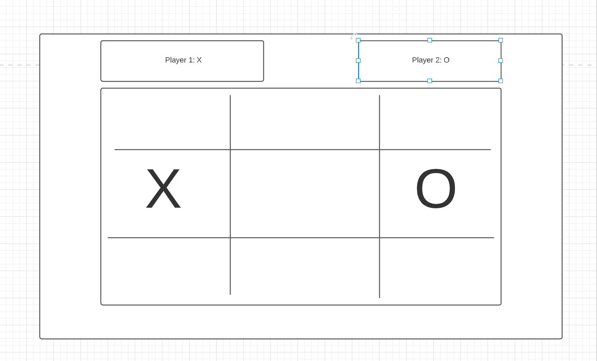
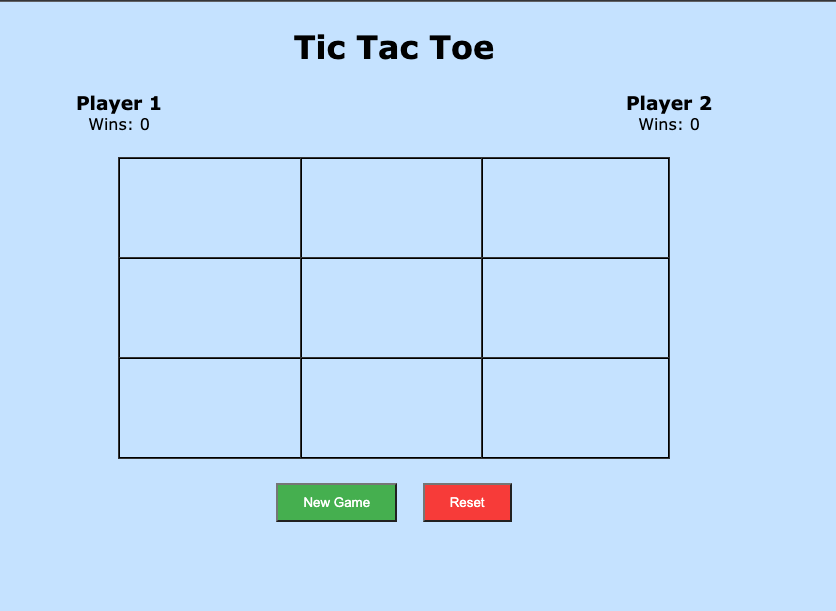

# tic-tac-toe

A fun and exciting tic tac toe game

## Tech Used

-   HTML
-   CSS
-   JavaScript

## Key Features

-   Win counter keeping track of wins for both players
-   A button to start a new game, while maintaining win records
-   A reset button to start over from scratch

## Initial Design

## Final UI

## Planning

-   I started by building a basic grid using HTML and CSS grids.
-   Within the JavaScript file I started by selecting the individual cells and hard coding an X sign within.
-   For a few days I kept iterating and starting over again as I struggled to settle on a correct approach.
-   From there one of my pain points became how to keep track of player turns. I solved that by using a counter approach with the modulus operator.
-   Once that was solved the next challenge was determining how to check winning conditions. I'm sure there were more elegant solutions but I used a giant if/else statement checking every possibility based on array indices. I also solved how to ensure that clicking on the same cell doesn't override the previous value.
-   After that I implemented cosmetic changes and added the functionality to keep track of user wins and displaying winning messages on the screen.
-   Last minute bug solved was making sure that once a game was won users can't keep playing until a new game is started or reset

## Game link

https://mauricekcamara.github.io/tic-tac-toe/
